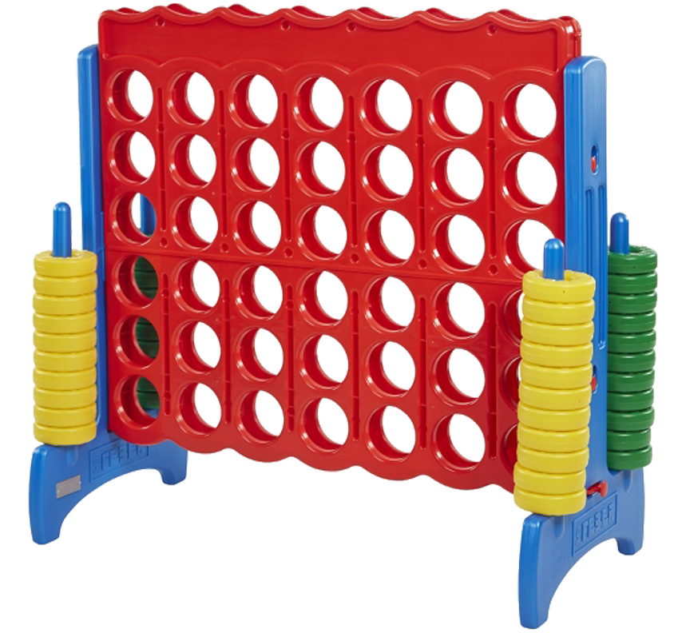
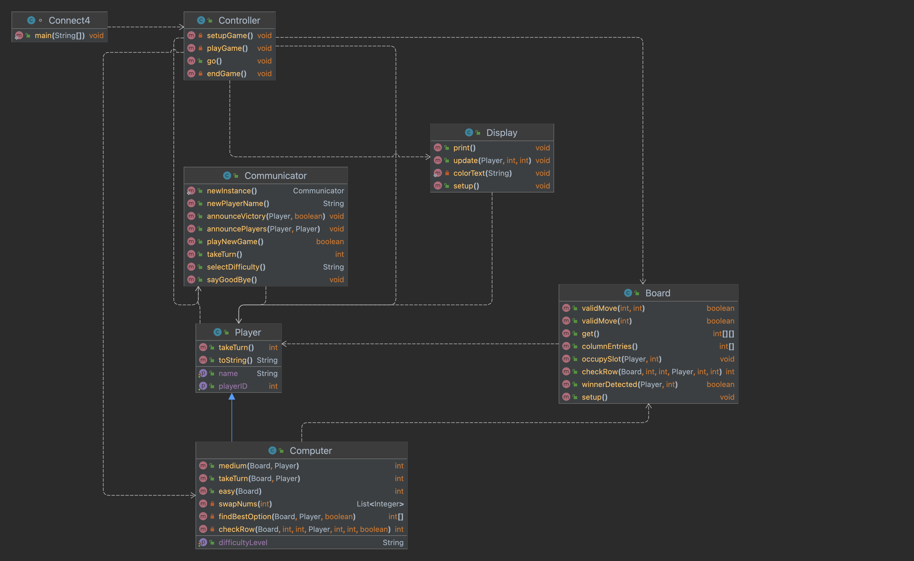
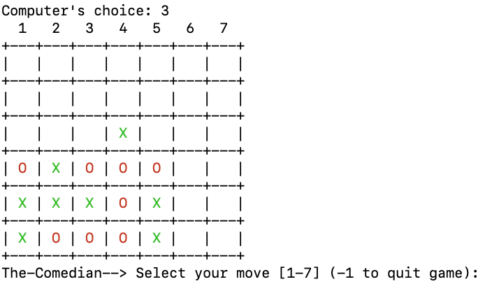
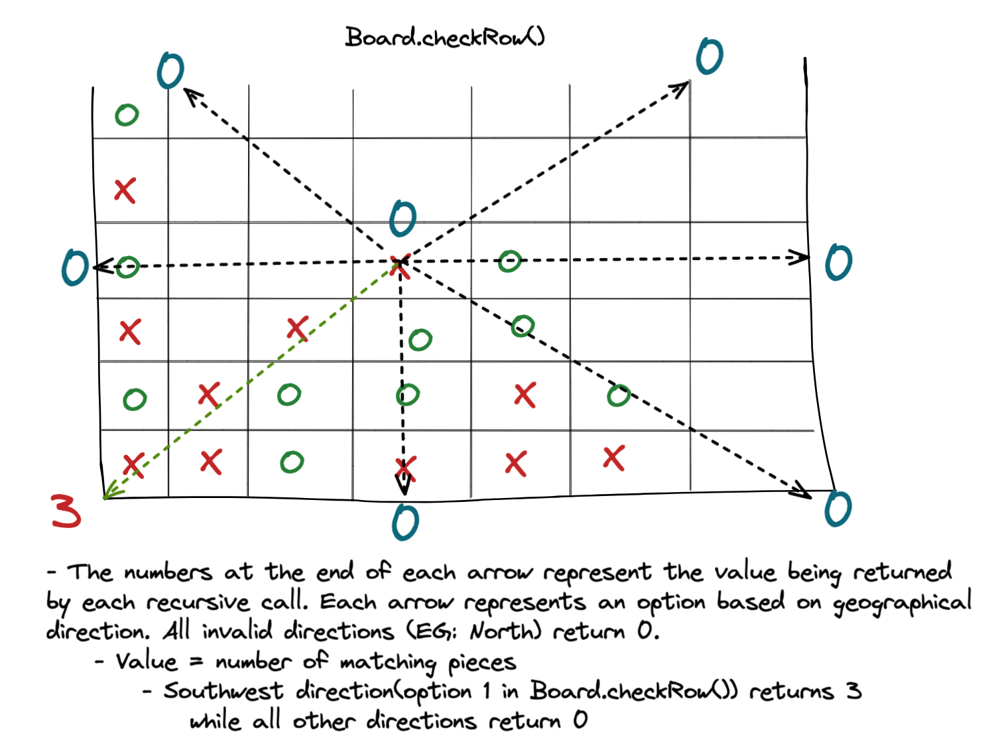

<!-- Improved compatibility of back to top link: See: https://github.com/othneildrew/Best-README-Template/pull/73 -->
<a name="readme-top"></a>

<!-- PROJECT SHIELDS -->
<!--
*** I'm using markdown "reference style" links for readability.
*** Reference links are enclosed in brackets [ ] instead of parentheses ( ).
*** See the bottom of this document for the declaration of the reference variables
*** for contributors-url, forks-url, etc. This is an optional, concise syntax you may use.
*** https://www.markdownguide.org/basic-syntax/#reference-style-links
-->
[![Contributors][contributors-shield]][contributors-url]
[![Forks][forks-shield]][forks-url]
[![Stargazers][stars-shield]][stars-url]
[![Issues][issues-shield]][issues-url]
[![MIT License][license-shield]][license-url]  

<!-- PROJECT LOGO -->
<br />
<div align="center">
  <a href="https://github.com/OREdwardsJr/TLG">
    
  </a>
  

<h1 align="center">Connect 4</h3>

  <p align="center">
    This is a Java based application based off of the famous game Connect 4. Players take turns choosing open slots on the board until a player
    has 4 connected pieces (horizontally, vertically, or diagonally). If all slots are occupied, with no matching 4 pieces, then a tie occurs!
    <br />
    <a href="https://github.com/OREdwardsJr/TLG/tree/main/src/com/connect4"><strong>Explore the docs »</strong></a>
    <br />
    <br />
    <a href="https://github.com/OREdwardsJr/repo_name/issues">Report Bug</a>
    ·
    <a href="https://github.com/OREdwardsJr/repo_name/issues">Request Feature</a>
  </p>
</div>


<!-- TABLE OF CONTENTS -->
<details>
  <summary>Table of Contents</summary>
  <ol>
    <li>
      <a href="#about-the-project">About The Project</a>
      <ul>
        <li><a href="#built-with">Built With</a></li>
      </ul>
    </li>
    <li>
      <a href="#getting-started">Getting Started</a>
      <ul>
        <li><a href="#prerequisites">Prerequisites</a></li>
        <li><a href="#installation">Installation</a></li>
      </ul>
    </li>
    <li><a href="#usage">Usage</a></li>
    <li><a href="#roadmap">Roadmap</a></li>
    <li><a href="#contributing">Contributing</a></li>
    <li><a href="#license">License</a></li>
    <li><a href="#contact">Contact</a></li>
    <li><a href="#acknowledgments">Acknowledgments</a></li>
  </ol>
</details>

<!-- MEET THE TEAM -->
## Meet The Contributors - Ad HOC - and their contributions
  - ### Hency 
    - Contributions
      - User input interface and validation
      - UI Connections
      - Final UML Diagram
      - Software package/deployment
      - Console setup and testing (Windows and MacOS)
    - Setbacks/Lessons Learned
      - Mistakenly broke local project
      - Failing tests due to overuse of static methods (be weary of Static)
      - Do not attach attach yourself to code, you will end up either rewriting it or tossing it to the side
      - Communications of ideas is key, questions are a must while implementing code
      - Clarify which data structures being used, if any
    - Contact
      - [LinkedIn](https://www.linkedin.com/in/hencyp/)
  - ### Orlando 
    - Contributions
      - API design
      - End game detection logic
      - Computer logic
      - Initial diagram
      - README document
    - Setbacks/Lessons Learned
      - (Setback) Frustration extended completion of computer logic by a day
        - Better naming conventions may have helped me find this bug sooner
      - (Lesson Learned) Stronger in OOP but still need some work
      - (Lesson Learned) Effective collaboration makes solving technical problems much smoother
    - Contact
      - [LinkedIn](https://www.linkedin.com/in/orlando-edwards-jr/)
  - ### Coel
    - Contributions
      - User interface 
      - ASCII art
      - Board design
      - Testing
    - Setbacks/Lessons 
      - Communication is important
      - There was a learning curve with operating IntelliJ and Git
      - The project is like a puzzle or dominoes where 1 move can impact another area

<!-- Agenda -->
## Agenda
- #### High level overview of project
- #### Demo of app
- #### QnA / Technical discussion

<!-- ABOUT THE PROJECT -->
## About The Project

<h3 align="center">Initial Diagram</h3>


<h3 align="center">Final Diagram</h3>


<h3 align="center">Product Screenshot</h3>


<h3 align="center">Board Tracking Logic</h3>





### Features
- #### Initial
   - 2 player game
- #### Extended
   - 1 player functionality
- #### Wishlist
   - Animation
   - Scoreboard
   - 3rd difficultly level
   

<p align="right">(<a href="#readme-top">back to top</a>)</p>


### Built With


<p align="right">(<a href="#readme-top">back to top</a>)</p>


<!-- GETTING STARTED -->
## Getting Started

This is an example of how you may give instructions on setting up your project locally.
To get a local copy up and running follow these simple example steps.

### Prerequisites

This is an example of how to list things you need to use the software and how to install them.
* npm
  ```sh
  npm install npm@latest -g
  ```

### Installation

1. Get a free API Key at [https://example.com](https://example.com)
2. Clone the repo
   ```sh
   git clone https://github.com/OREdwardsJr/TLG.git
   ```
3. Install NPM packages
   ```sh
   npm install
   ```
4. Enter your API in `config.js`
   ```js
   const API_KEY = 'ENTER YOUR API';
   ```

<p align="right">(<a href="#readme-top">back to top</a>)</p>


<!-- CONTRIBUTING -->
## Contributing

Contributions are what make the open source community such an amazing place to learn, inspire, and create. Any contributions you make are **greatly appreciated**.

If you have a suggestion that would make this better, please fork the repo and create a pull request. You can also simply open an issue with the tag "enhancement".
Don't forget to give the project a star! Thanks again!

1. Fork the Project
2. Create your Feature Branch (`git checkout -b feature/AmazingFeature`)
3. Commit your Changes (`git commit -m 'Add some AmazingFeature'`)
4. Push to the Branch (`git push origin feature/AmazingFeature`)
5. Open a Pull Request

<p align="right">(<a href="#readme-top">back to top</a>)</p>


<!-- CONTACT -->
## Contact

* Hency - [LinkedIn](https://www.linkedin.com/in/hencyp/)
* Orlando - [LinkedIn](https://www.linkedin.com/in/orlando-edwards-jr/)
* Coel - 

<p align="right">(<a href="#readme-top">back to top</a>)</p>


<!-- ACKNOWLEDGMENTS -->
## Acknowledgments

* Thank you to TLG and Jay for creating and delivering an effective Java learning experience.


<p align="right">(<a href="#readme-top">back to top</a>)</p>


<!-- MARKDOWN LINKS & IMAGES -->
<!-- https://www.markdownguide.org/basic-syntax/#reference-style-links -->
[contributors-shield]: https://img.shields.io/github/contributors/OREdwardsJr/TLG.svg?style=for-the-badge
[contributors-url]: https://github.com/OREdwardsJr/TLG/graphs/contributors
[forks-shield]: https://img.shields.io/github/forks/OREdwardsJr/TLG.svg?style=for-the-badge
[forks-url]: https://github.com/OREdwardsJr/TLG/network/members
[stars-shield]: https://img.shields.io/github/stars/OREdwardsJr/TLG.svg?style=for-the-badge
[stars-url]: https://github.com/OREdwardsJr/TLG/stargazers
[issues-shield]: https://img.shields.io/github/issues/OREdwardsJr/TLG.svg?style=for-the-badge
[issues-url]: https://github.com/OREdwardsJr/TLG/issues
[license-shield]: https://img.shields.io/github/license/OREdwardsJr/TLG.svg?style=for-the-badge
[license-url]: https://github.com/OREdwardsJr/TLG/blob/master/LICENSE.txt
[linkedin-shield]: https://img.shields.io/badge/-LinkedIn-black.svg?style=for-the-badge&logo=linkedin&colorB=555
[linkedin-url-hency]: https://www.linkedin.com/in/hencyp/
[linkedin-url-orlando]: https://www.linkedin.com/in/orlando-edwards-jr/
[linkedin-url-coel]: https://www.linkedin.com/
[product-screenshot]: images/Connect4_terminal.png
[Next.js]: 
[Next-url]: https://nextjs.org/
[React.js]: https://img.shields.io/badge/React-20232A?style=for-the-badge&logo=react&logoColor=61DAFB
[React-url]: https://reactjs.org/
[Vue.js]: https://img.shields.io/badge/Vue.js-35495E?style=for-the-badge&logo=vuedotjs&logoColor=4FC08D
[Vue-url]: https://vuejs.org/
[Angular.io]: https://img.shields.io/badge/Angular-DD0031?style=for-the-badge&logo=angular&logoColor=white
[Angular-url]: https://angular.io/
[Svelte.dev]: https://img.shields.io/badge/Svelte-4A4A55?style=for-the-badge&logo=svelte&logoColor=FF3E00
[Svelte-url]: https://svelte.dev/
[Laravel.com]: https://img.shields.io/badge/Laravel-FF2D20?style=for-the-badge&logo=laravel&logoColor=white
[Laravel-url]: https://laravel.com
[Bootstrap.com]: https://img.shields.io/badge/Bootstrap-563D7C?style=for-the-badge&logo=bootstrap&logoColor=white
[Bootstrap-url]: https://getbootstrap.com
[JQuery.com]: https://img.shields.io/badge/jQuery-0769AD?style=for-the-badge&logo=jquery&logoColor=white
[JQuery-url]: https://jquery.com 
